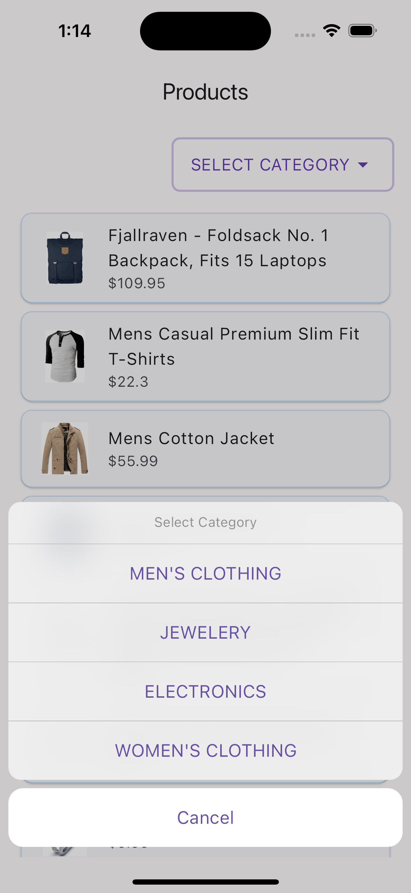
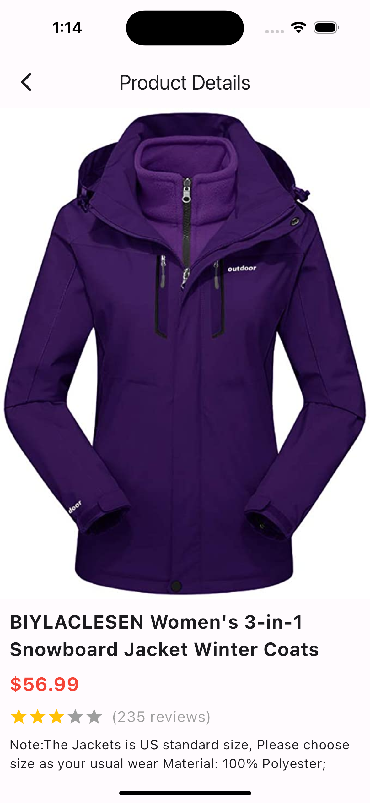

# E-commerce Flutter App

A simple e-commerce-like mobile application built using Flutter that displays products and categories from the [Fake Store API](https://fakestoreapi.com). The app also implements local caching for better offline performance.

## Features

- **View Products**: Browse through a list of products fetched from the Fake Store API.
- **Categories**: Filter products by category.
- **Local Caching**: Products are cached locally using the `flutter_cache_manager` to allow offline viewing.
- **Routing**: Navigation between different screens is handled with `go_router`.
- **State Management**: The app uses `flutter_bloc` for managing the application state.

## API

This app uses the [Fake Store API](https://fakestoreapi.com) to fetch product and category data.

## Screenshots

### Home Screen


### Product Details Screen


## Getting Started

### Prerequisites

- [Flutter SDK](https://flutter.dev)
- [Dart SDK](https://dart.dev)
- Internet connection (for initial data fetch from Fake Store API)

### Installation

1. Clone this repository:

   ```bash
   git clone https://github.com/Basil-Baby-94/flutter-ecommerce-app.git
   cd flutter-ecommerce-app

